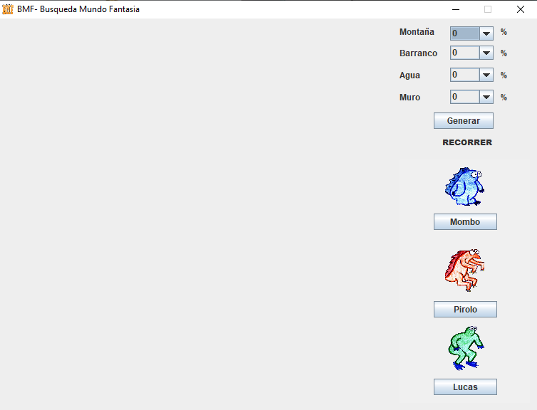
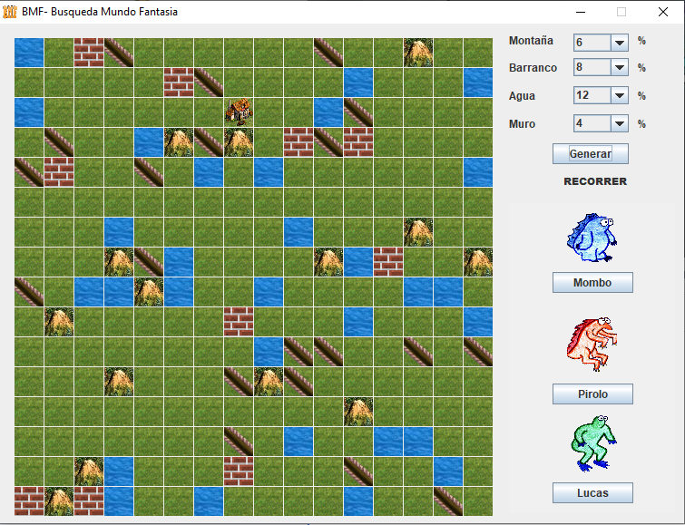
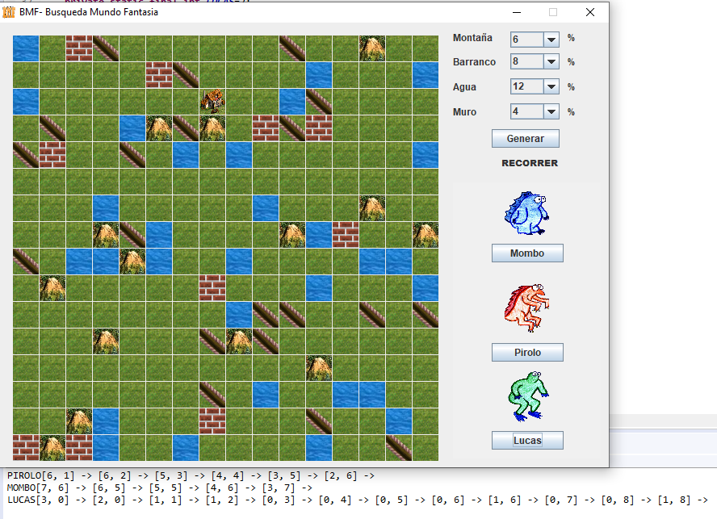

# BMF-BusquedaMundoFantasia

Simple hill climbing implementation, running N random iterations to find a path to take a character to the house, balancing the weights(costs) for each link in the graph acording to the capacity of the character:
*Mombo - less cost in mountains
*Pirolo - less cost in ravines
*Lucas - less cost in water

